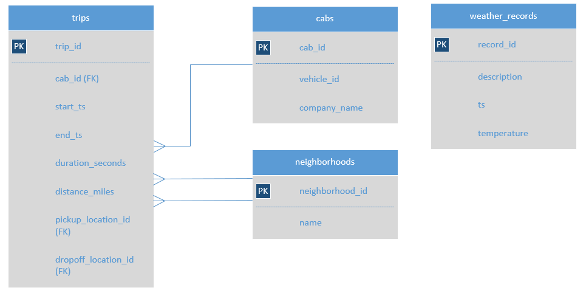

# Taxi-Trends-Data-Collection
# Taxi Service Insights: Unveiling Ride Patterns, Demand Hotspots, and Weather Effects

## Introduction
This project involves an explorative analysis of taxi ride data with the aim of exploring various aspects of the taxi service patterns of top comapnies and locations. 
To begin with, we analyzed the dataset to identify the top 10 neighborhoods with the highest number of dropoffs. This analysis provides an understanding of the demand and popularity of taxi services in different areas of the city. By graphing the data, we can easily identify the neighborhoods that generate the most demand for taxi rides.

We begin by preprocessing the data, ensuring its quality and relevance to our analysis, and will also analyze taxi ride data and test a hypothesis regarding the average duration of rides from the Loop to O'Hare International Airport on rainy Saturdays compared to other Saturdays. The analysis aims to uncover whether there is a statistically significant difference in ride durations based on weather conditions. To achieve this, we have collected a dataset containing information about taxi rides, including the pickup date and time, weather conditions, and duration of the rides. By examining these datasets, we can explore the relationship between weather conditions and ride durations and determine if rainy Saturdays exhibit different ride durations compared to other Saturdays.

Description of the data

A database with info on taxi rides in Chicago:

neighborhoods table: data on city neighborhoods

name: name of the neighborhood

neighborhood_id: neighborhood code

cabs table: data on taxis

cab_id: vehicle code

vehicle_id: the vehicle's technical ID

company_name: the company that owns the vehicle

trips table: data on rides

trip_id: ride code

cab_id: code of the vehicle operating the ride

start_ts: date and time of the beginning of the ride (time rounded to the hour)

end_ts: date and time of the end of the ride (time rounded to the hour)

duration_seconds: ride duration in seconds

distance_miles: ride distance in miles

pickup_location_id: pickup neighborhood code

dropoff_location_id: dropoff neighborhood code

weather_records table: data on weather

record_id: weather record code

ts: record date and time (time rounded to the hour)

temperature: temperature when the record was taken

description: brief description of weather conditions, e.g. "light rain" or "scattered clouds"

## Table Scheme

## Conclusion
We imported the data and searched for inconsistences and null values. We found that there were no duplicates or null values. We then merged the dataframes and created graphs to show the top 10 dropoff locations and taxi companies. 

The **top 10 companies** were Flash Cab, Taxi Affiliation Services, Yellow Cab, Medallion Leasing, Taxi Affiliation Service Yellow, Chicago Carriage Cab Corp, City Service, Sun Taxi, Star North Management LLC, and Blue Ribbon Taxi Association Inc.

The **top 10 dropoff locations** were Loop, River North, Streeterville, West Loop, O'Hare, Lake View, Grant Park, Museum Campus, Gold Coast, and Sheffield & DePaul.

We then imported the next dataframe and converted the start_ts column to datetime. Then created a new column for the day of the week as well as a new dataframe for Saturdays with the weather conditions. After calculating the average duration of rides on good, or rainy weather Saturdays, we then calculated the t-statistic and p-value. Testing the hypothesis with a calculated t-statistic and p-value, we then compared the p-value to the alpha value, which determined to reject the null hypothesis. We concluded that there is statistically significant difference in average ride durations on rainy Saturdays.

