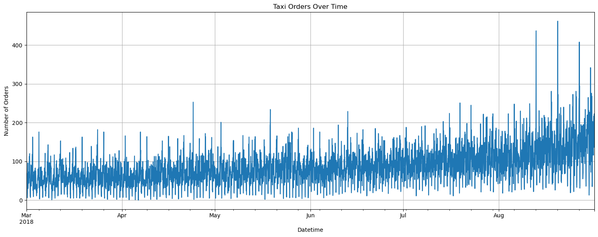
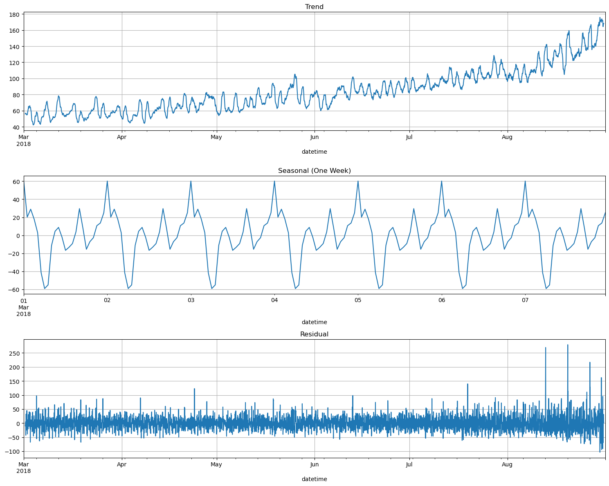

# Time-Series-Predicting-Taxi-Orders
A Taxi Company aims to optimize its driver allocation during peak hours at airports. Utilizing historical data on taxi orders, developed a predictive model to forecast the number of taxi orders for the upcoming hour. 

# Project description
A Taxi company has collected historical data on taxi orders at airports. To attract more drivers during peak hours, we need to predict the amount of taxi orders for the next hour. Build a model for such a prediction.

The RMSE metric on the test set should not be more than 48.

## Project instructions

1. Download the data and resample it by one hour.
2. Analyze the data.
3. Train different models with different hyperparameters. The test sample should be 10% of the initial dataset. 
4. Test the data using the test sample and provide a conclusion.

## Data description

The data is stored in file `taxi.csv`. The number of orders is in the '*num_orders*' column.

## Evaluation

There's a clear upward trend in taxi orders over time, indicating that the demand for taxis has been increasing.

Some periodic patterns can be observed, which may be related to daily or weekly cycles. This suggests that there might be specific hours or days with consistently higher or lower demand.

The decomposition of the time series into trend, seasonal, and residual components provides the following insights:

1. **Trend:** There's a noticeable upward trend in taxi orders over time, confirming our initial observation.

2. **Seasonal:** By looking at one week of seasonal data, we can clearly see daily patterns. The peaks might represent the hours with the highest demand each day, and the troughs the hours with the lowest demand. This suggests that certain times of the day consistently have higher or lower demand for taxis.

3. **Residual:** The residuals show the noise or irregularities that aren't captured by the trend or seasonal components. The variance in residuals seems to increase over time, suggesting the possibility of heteroscedasticity (i.e., non-constant variance).
  
## Modeling Results:

**The Linear Regression:**
- RMSE on Training Data: 25.70
- RMSE on Test Data: 45.77

**Random Forest Regressor:**
- Training Data: 8.568.56
- Test Data: 43.6843.68

**Gradient Boosting Regressor:**

- Training Data: 19.5919.59
- Test Data: 43.7943.79

<table>
    <tr>
        <th>Model</th>
        <th>RMSE on Training Data</th>
        <th>RMSE on Test Data</th>
    </tr>
    <tr>
        <td>Linear Regression</td>
        <td>25.70</td>
        <td>45.77</td>
    </tr>
    <tr>
        <td>Random Forest Regressor</td>
        <td>8.56</td>
        <td>43.68</td>
    </tr>
    <tr>
        <td>Gradient Boosting Regressor</td>
        <td>19.59</td>
        <td>43.79</td>
    </tr>
</table>

  
The RMSE on the test data is below the threshold of 48.

## Conclusion

- All models (Linear Regression, Random Forest, Gradient Boosting) meet the RMSE requirement of being less than 48 on the test set.
- Among the models, Random Forest and Gradient Boosting perform better than Linear Regression on the test set, but they seem to overfit on the training data.
- Feature engineering, especially creating lags and rolling means, seems to have helped capture the time series patterns effectively.

After refining our model with optimal hyperparameters and training it on a combined dataset of training and validation sets, we evaluated its performance on the test set. The model achieved an RMSE of 
43.33, which is below the threshold of 48 and also indicates a substantial improvement from our initial models. The RMSE suggests that our model can predict taxi orders for the next hour with a mean error of approximately 43 orders. This level of accuracy is promising for practical applications, as it can aid taxi companies in efficiently allocating resources during peak hours.
